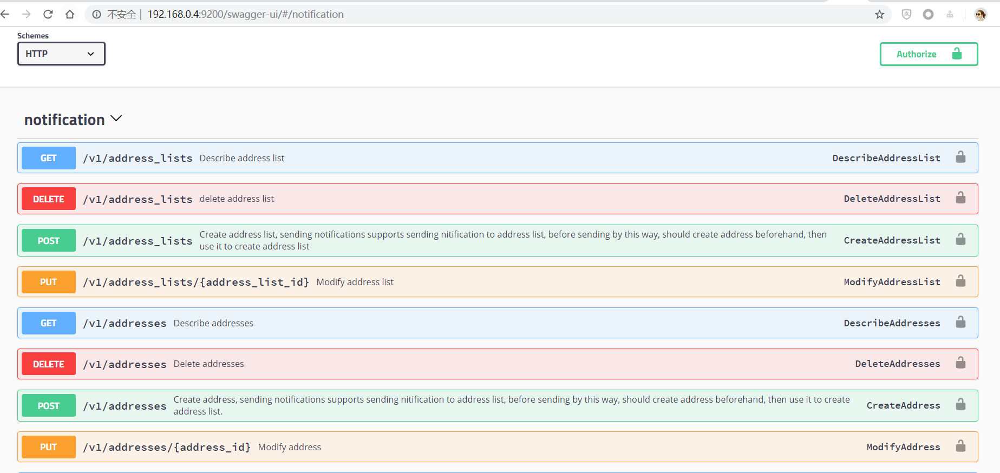

All-in-One 模式部署由 [Docker-Compose](https://github.com/docker/compose) 的方式启动运行项目，Compose 能够定义和运行多个 Docker 容器的应用，允许用户通过一个单独的 docker-compose.yml 模板文件（YAML 格式）来定义一组相关联的应用容器为一个项目（project），通过子命令可对项目中的一组容器进行便捷地生命周期管理。

## 第一步: 准备环境

### 主机环境

需要准备一台满足最小资源要求的主机节点开始 `all-in-one` 模式的部署。

|   CPU  |  Memory |  磁盘  |
|--------|---------|-------|
|  1 核  |    1 G  |  10 G |

### 软件环境

`All-in-One` 模式需要依赖以下软件，请预先在主机中安装符合以下版本要求的软件:

| 软件需求 | 最低版本 |
| --- | --- |
| [Docker](https://docs.docker.com/install/) | 18.03.0-ce |
| [Docker-Compose](https://docs.docker.com/compose/install/) | 1.21.0 |
| [Make](https://www.gnu.org/software/make/) | 3.81 |

> 说明：若主机已安装 Kubernetes 环境，可能会造成 docker 容器之间网络不通。

## 第二步: 准备 Notification 源文件压缩包

1. 可通过 wget 命令从 GitHub 指定的 URL 下载 [Notification](https://github.com/openpitrix/notification/releases/tag/v0.2.1) 的源文件压缩包。

```bash
$ wget https://github.com/openpitrix/notification/archive/v0.2.1.tar.gz
```
2. 解压压缩包：

```bash
$ tar -zxf notification-0.2.1.tar.gz
```

## 第三步: 部署 Notification

进入 解压后的 Notification 目录，编译项目。该过程需要拉取多个 Notification 相关的 docker 镜像，拉取镜像和安装速度与网络也有关系，需要等待几分钟。

```bash
$ cd notification-0.2.1/
$ make build
$ make compose-up
```

## 第四步: 验证

1. 查看所有容器的运行状况，正常情况下所有容器状态应该如下所示，确保 Notification 相关的镜像都已经成功创建：

```bash
$ docker-compose ps
              Name                             Command               State                        Ports                     
----------------------------------------------------------------------------------------------------------------------------
notification-db                     docker-entrypoint.sh --low ...   Up       0.0.0.0:13306->3306/tcp                       
notification-etcd                   etcd --data-dir /data --li ...   Up       0.0.0.0:12379->2379/tcp, 2380/tcp             
notification-manager                notification                     Up       0.0.0.0:9200->9200/tcp, 0.0.0.0:9201->9201/tcp
notification-notification-db-ctrl   flyway -url=jdbc:mysql://n ...   Exit 1                                                 
notification-redis                  docker-entrypoint.sh redis ...   Up       0.0.0.0:6379->6379/tcp  
```

2. 您可以通过浏览器，使用运行该服务的服务器的 IP 地址和 SwaggerUI 端口号即 `<NodeIP>:9200` 可以内部网络访问 SwaggerUI 页面，如 `http://192.168.0.4:9200/swagger-ui/#/notification`。

若需要在外网访问，在云平台需要在端口转发规则中将上述的**内网端口** 9200 转发到**源端口** 9200，然后在防火墙开放这个**源端口**，确保外网流量可以通过该端口。

> 提示：例如在 QingCloud 平台配置端口转发和防火墙规则，则可以参考 [云平台配置端口转发和防火墙](https://openpitrix.io/docs/v0.4/zh-CN/appendix/qingcloud-manipulation)。

然后可以通过 `<EIP>:9200` 的方式访问控制台，如：`http://139.198.111.111:9200`，即可进入 Notification Swagger 页面。

 

3. 查看 API Gateway 服务

Notification 部署成功后，可以在 SwaggerUI 界面下体验一下各个 API 的使用，了解各个 API 的参数设置和具体使用。

Notification API 文档请参考 SwaggerUI 上详细的描述。 


## 清理环境

若需要卸载 Notification 清理环境，在项目文件目录下，执行以下命令，停止并删除 Notification 所有服务，请谨慎操作。

```bash
$ docker compose-down 
```
